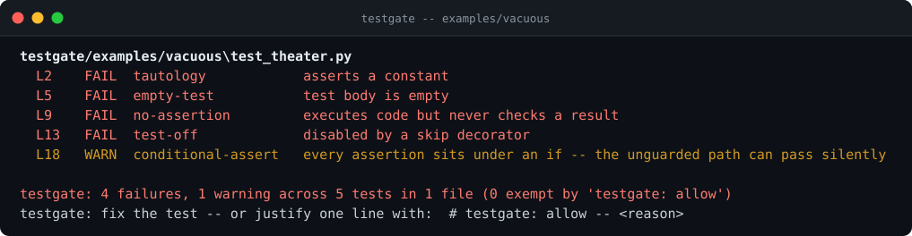
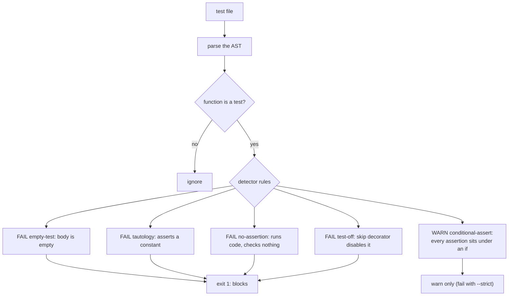

# testgate

**Find tests that cannot fail.** Empty bodies, assertions on constants, skip-disabled tests, checks hidden under `if` - green runs that prove nothing. `testgate` statically scans your test tree and fails the build while the test theater is still in the script: milliseconds, offline, no coverage dashboard required.

[](https://github.com/F0Rextasy/testgate/actions/workflows/test.yml)
[](https://www.python.org/)
[](https://skills.sh/F0Rextasy/testgate)
[](LICENSE)



## Why this exists

Coverage went up, the suite stayed green, and the bug shipped anyway - the new test asserted a constant, the "disabled" one skipped on every machine, and the real check sat under `if DEBUG:` where CI never goes. Vacuous tests are worse than no tests: they buy false confidence and hide the gap behind a checkmark. `testgate` reads the AST, finds tests that have no path to red, and makes that a build failure - the same way a linter makes a syntax error one.

## Quick start

```bash
# install the skill into any agent (Claude Code, Codex, Cursor, OpenCode, ...):
npx skills add F0Rextasy/testgate

# or run it directly:
git clone https://github.com/F0Rextasy/testgate
cd myproject
python /path/to/testgate/scripts/testgate.py tests/ --strict
```

| Exit | Meaning |
| --- | --- |
| `0` | every test can fail (warnings allowed unless `--strict`) |
| `1` | findings fail the gate |
| `2` | usage error |

Point it at a project root (default `.`) or a single test file. Works on pytest/unittest-style Python out of the box; `--format json` for machines.

## How it decides



Full rule catalogue with per-rule severity: [references/RULES.md](references/RULES.md).

## What it catches (real output)

```console
$ python scripts/testgate.py examples/vacuous --no-color
testgate/examples/vacuous\test_theater.py
  L2    FAIL  tautology            asserts a constant
  L5    FAIL  empty-test           test body is empty
  L9    FAIL  no-assertion         executes code but never checks a result
  L13   FAIL  test-off             disabled by a skip decorator
  L18   WARN  conditional-assert   every assertion sits under an if -- the unguarded path can pass silently

testgate: 4 failures, 1 warning across 5 tests in 1 file (0 exempt by 'testgate: allow')
testgate: fix the test -- or justify one line with:  # testgate: allow -- <reason>
[exit 1]
```

A deliberate exception gets an in-place exemption that travels with the line:

```python
def test_version_constant():
    assert __version__  # testgate: allow -- version is compile-time fixed
```

## Wire it into CI

```yaml
- uses: actions/checkout@v4
- name: test theater gate
  run: python testgate/scripts/testgate.py tests/ --strict
```

Run it next to the suite: the suite says *did the tests pass?*, testgate says *could they have failed?*

## What it will never do

- Execute your tests - findings come from the AST, so a slow or side-effecting suite is scanned safely.
- Flag a test for style - only for having no path to a red result.
- Fail on a line you explicitly justified with `# testgate: allow -- <reason>`.

## The family

Deterministic gates - one Python script each, stdlib, same exit contract:

| Gate | Catches |
| --- | --- |
| [preflight](https://github.com/F0Rextasy/preflight) | committed `.env`, weak secrets, debug-in-prod, wildcard CORS |
| [bandaid](https://github.com/F0Rextasy/bandaid) | symptom-suppression patches: swallowed errors, disabled tests, removed guards |
| [prove-it](https://github.com/F0Rextasy/prove-it) | claims with no executed evidence behind them |
| **testgate** (this repo) | tests that can never fail |
| [shipcheck](https://github.com/F0Rextasy/shipcheck) | broken, unimportable, or stale release artifacts |
| [dsh-gate](https://github.com/F0Rextasy/dsh-gate) | red turns closing green in DeepSeek Harness |
| [ci-triage](https://github.com/F0Rextasy/ci-triage) | red CI triaged without an LLM |
| [docproof](https://github.com/F0Rextasy/docproof) | documentation snippets that no longer parse or run |

## License

[MIT](LICENSE)
